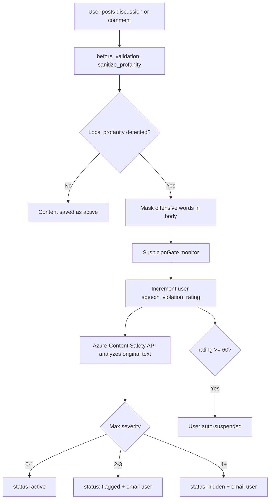

<div align="center">
  <h1>Page Chat</h1>
  <p>
    A book discovery and reading platform where users browse curated titles,
    read previews, and join safe book discussions.
  </p>
  <p>
    <a href="https://pagechat.simongideon.me"><strong>Live Demo</strong></a>
    ·
    <a href="#highlight-ai-powered-content-moderation"><strong>Content Moderation</strong></a>
    ·
    <a href="#tech-stack"><strong>Tech Stack</strong></a>
  </p>
  <p>
    
    
    
    
    
  </p>
</div>

---

## Overview

**Page Chat** helps readers discover books by category, author, featured picks, and recommendations. Users can sign in with email or Google, read previews, track progress, and take part in book discussions.

Admins can manage books, authors, categories, members, uploaded files, and moderation from a custom dashboard.

## Screenshots

<p align="center">
  
  
</p>

## Core Features

| Feature | Description |
|---------|-------------|
| Book discovery | Browse titles by category, author, featured picks, and recommendations |
| Reading experience | Read previews and track reading progress |
| Community discussions | Create discussions and comments around books |
| Authentication | Sign in with email/password or Google OAuth |
| Admin dashboard | Manage books, authors, categories, users, reports, and uploads |
| Object storage | Store book covers and PDFs with MinIO |

## Highlight: AI-Powered Content Moderation

The strongest part of this solution is its **content safety pipeline**. Page Chat protects discussions using a two-layer moderation system:

- **Local filtering:** catches profanity and suspicious patterns immediately using a custom blacklist
- **Azure AI Content Safety:** analyzes risky text for hate, violence, sexual, and self-harm categories

Depending on severity, content is either published, flagged for review, or hidden. Repeat offenders accumulate a violation score and are automatically suspended at **60 points**.

### Moderation Flow



### Moderation Files

| File | Purpose |
|------|---------|
| `back-end/app/models/concerns/profanity_filterable.rb` | Entry point that runs before validation on discussions and comments |
| `back-end/app/services/content_safety/suspicion_gate.rb` | Local suspicion rules and Azure trigger |
| `back-end/app/services/content_safety/azure_content_safety.rb` | Azure AI Content Safety API client |
| `back-end/config/blacklist.yml` | Custom profanity blacklist |

## Tech Stack

| Layer | Stack |
|-------|-------|
| Frontend | React, Vite, Redux Toolkit, Tailwind CSS |
| Backend | Ruby on Rails 7, Devise JWT, OmniAuth (Google) |
| Storage | PostgreSQL, Redis, MinIO (S3-compatible) |
| Moderation | Obscenity gem + Azure AI Content Safety |
| Runtime | Docker Compose, Nginx, Let's Encrypt SSL |

## Project Structure

```text
page_chat/
├── back-end/     # Rails API + Trestle admin
├── front-end/    # React SPA
└── docker-compose.yml
```

## Local Development

Development uses the **production PostgreSQL** on the server via an SSH tunnel.

Open the database tunnel:

```bash
ssh -L 5432:localhost:5432 epic@89.167.4.31 -N -f
```

Start the backend:

```bash
cd back-end && rails s
```

Close the tunnel:

```bash
pkill -f "ssh -L 5432"
```

---

<div align="center">
  <p><strong>Page Chat</strong> — safer book discussions powered by Rails, React, and Azure AI.</p>
</div>
